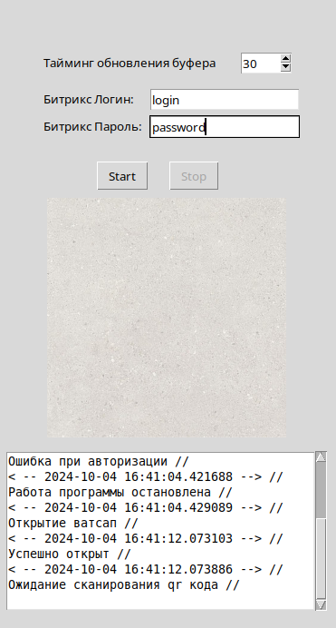
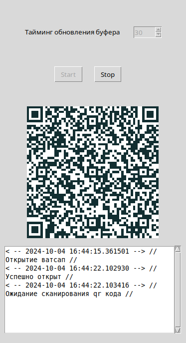
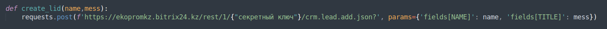
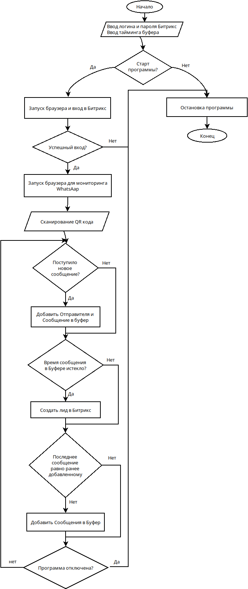

<h2>Программа для создания лидов в Битрикс 24 из сообщений с Whatsapp Web</h2>
 
<h3>Описание</h3>

Скрипт на Python с графическим интерфейсом библиотеки Tkinter и автоматизацией браузера Selenium в headless(скрытом) режиме. Программа парсит новые сообщения с Ватсапп Вэб и при поступлении новых сообщений создает лид в системе Битрикс 24. Присутсвуют 2 реалиции, первая с запуском двух браузеров, вторая с запуском обного для Ватсапп Веб, а лиды создаются простым post запросом.

 
<h2>Как пользоваться?</h2>
<h3>Первая реализация</h3>

Введите логин и пароль от Битрикс 24. Также введите тайминг обновления буфера в секундах. Новые сообщения падают в буфер, по истечении времени создаентся лид из Имени контакта и Сообщения (Сообщений). После входа в Битрикс, скрипт предложит вам  отсканировать qr код Ватсапп Вэб. После успешного входа, при поступлении нового сообщения, сообщение падает в буфер. По истечении времени, из сообщений строится лид в Битрикс 24. Для чего нужен Буфер? Для того, чтобы не отправлять все сообщения от адресата в Битрикс, а по необходимости накопить сообщения и создать лид. Ваши сообщения не попадают в буфер, также изображения и голосовые сообщения. Внизу пишется небольшой лог последних действий. Также лог пишется в тестовый файл.

<h3>Вторая реализация</h3>

Тот же алгоритм работы, но второй браузер для Битрикса не запускается. Создание лидов осуществляется не через браузер, а через post запрос к серверу битрикса. Вам необходимо сформировать строку запроса в которой вы укажете свой секретный ключ. Получить его можете с админки Битрикса.

В коде пропишите свой секретный ключ

Вторая реализация полегче, что обеспечивает меньшую вероятность возникновения ошибки.

<h2>Алгоритм работы</h2>

